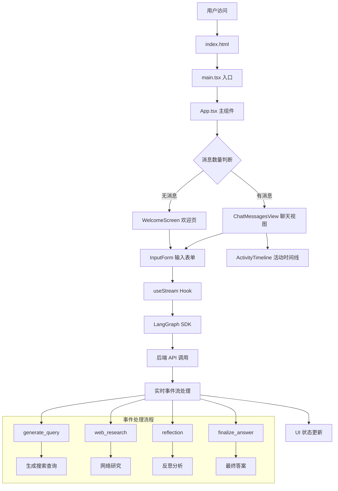
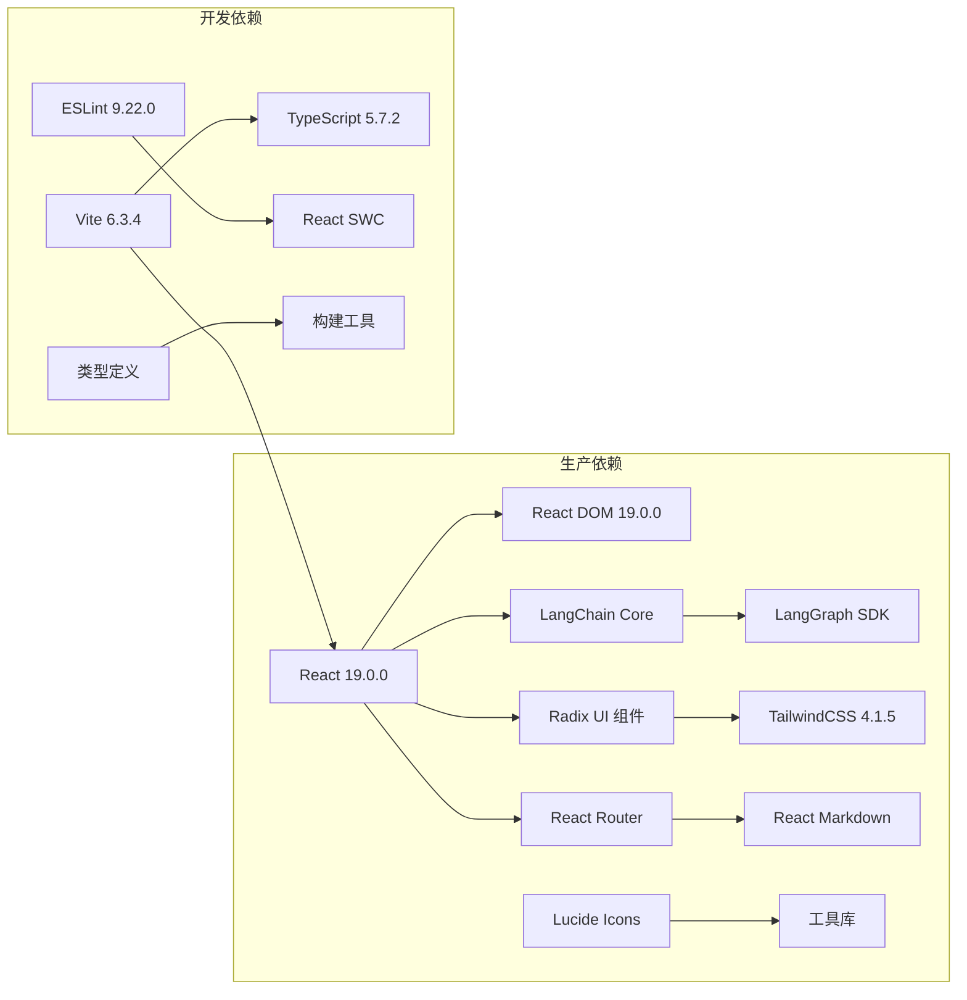

# prd 产品需求文档

> 状态说明（2026-02-19）：本文件为历史需求草稿沉淀。当前执行基线请以 `docs/decision.md`、`docs/requirements.md`、`docs/architecture.md`、`docs/tech_stack.md` 为准。

## 目录

- [ 绘图可视化](#-绘图可视化)
- [Benchmark](#Benchmark)
- [数据分析理论](#数据分析理论)
- [可优化项](#可优化项)

```markdown title="需求文档"
我要开发AI Web应用，并使用前后端分离的架构，前端使用Next.js等框架，后端使用python。
该AI应用是将表格数据智能分类和识别出其所属领域、场景等信息，然后进行依据这些信息和表格数据内容，进行可视化绘图。
其页面应该是类似AI Chat的页面，具有交互的能力，需要具备表格上传部分，对话框，输入框。AI返回的对话内容要流式响应，对话框部分应该可以实时反映后端的过程，比如执行完表格上传、表格识别和领域识别、表格数据预处理、对表格规划绘制哪些图形、表格绘图步骤，这些过程应该类似ThoughtChain一样显示

为进行充分的数据分析，爬取统计学和机器学习的理论知识，为各个理论添加使用场景和用例，整理成可以用于RAG的文档库，在进行数据分析时可以通过数据描述检索相关方法和知识，进行更深入的数据分析

爬取matplotlib、plotly、boken、altair等绘图库的文档，并整理成可用于RAG的格式，需要将这些文档内容划分成有效的snippets，类似context7所做的事，主要目的是确保根据需求能通过描述检索到正确的代码片段

# 前端开发技术栈：
TypeScript、React 19.1、Next.js 15(APP路由，使用src)、Tailwind CSS、ShadCN UI
使用Prettier和ESLint进行格式化和代码审查

# AI和后端技术栈：
FastAPI、Uvicorn、Pydantic
数据库：SQLAlchemy、PostgreSQL
向量数据库：Milvus
使用ruff进行python代码审查和格式化

# 前后端可视化
后端python使用Plotly库绘制图表，保存图表配置信息到json文件，js中使用plotly.js生成react交互式图表，由dash开发
python使用PyEcharts，js使用Echarts生成react交互式图表，由百度开发的
Altair是基于Vega-Lite的Python库，采用声明式语法，适合生成统计图表，学术场景常见。Vega-Lite的配置是JSON格式，前端可以通过Vega-Embed渲染，但需要额外的依赖。

不要摸棱两可的选择，对于同类型方法或工具，仅提供一个最有效最简洁的方案。对于选择的情况，请告知我。
```


# &#x20;绘图可视化

**Kroki**是一个开源的图形渲染服务，主要用于将文本描述的图表（如流程图、时序图、类图等）转换为图片。它支持多种流行的文本图表语法，比如[PlantUML](https://plantuml.com/ "PlantUML"),[Mermaid](https://mermaid-js.github.io/ "Mermaid"),[Graphviz](https://graphviz.gitlab.io/ "Graphviz"),[BlockDiag](https://blockdiag.com/ "BlockDiag")，和许多其他格式。

# Benchmark

[https://huggingface.co/spaces/adyen/DABstep](https://huggingface.co/spaces/adyen/DABstep "https://huggingface.co/spaces/adyen/DABstep")

[https://www.mphasis.com/content/dam/mphasis-com/global/en/home/innovation/next-lab/mphasis\_dabstep\_whitepaper.pdf](https://www.mphasis.com/content/dam/mphasis-com/global/en/home/innovation/next-lab/mphasis_dabstep_whitepaper.pdf "https://www.mphasis.com/content/dam/mphasis-com/global/en/home/innovation/next-lab/mphasis_dabstep_whitepaper.pdf")

# 数据分析理论

```mermaid 
graph TB
    subgraph "开发工具链"
        A[Vite 6.3.4] --> B[TypeScript 5.7.2]
        A --> C[ESLint 9.22.0]
        A --> D[React SWC Plugin]
    end
    
    subgraph "核心框架"
        E[React 19.0.0] --> F[React DOM 19.0.0]
        E --> G[React Router DOM 7.5.3]
    end
    
    subgraph "UI 组件库"
        H[Radix UI] --> I[Scroll Area]
        H --> J[Select]
        H --> K[Tabs]
        H --> L[Tooltip]
        H --> M[Slot]
    end
    
    subgraph "样式系统"
        N[TailwindCSS 4.1.5] --> O[Class Variance Authority]
        N --> P[Tailwind Merge]
        N --> Q[CLSX]
    end
    
    subgraph "LangChain 集成"
        R[@langchain/core] --> S[@langchain/langgraph-sdk]
        S --> T[useStream Hook]
    end
    
    subgraph "图标与工具"
        U[Lucide React] --> V[React Markdown]
    end
    
    A --> E
    E --> H
    E --> N
    E --> R
    E --> U
```








# 可优化项

前后端压缩传输，如pako在前端压缩/解压，支持 zlib/gzip 压缩。提高传输效率
