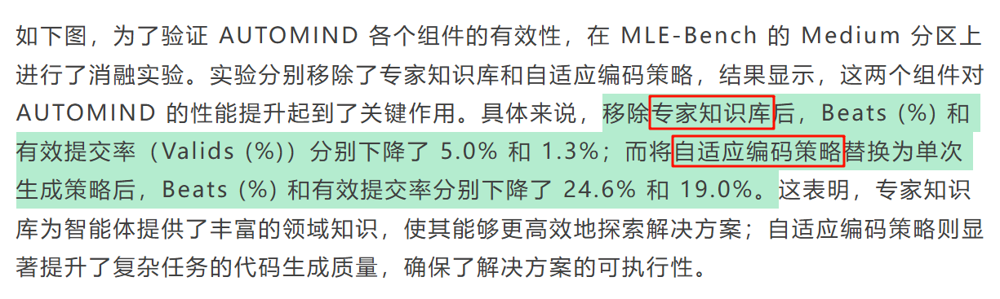

# 自动数据分析

早期的自动化特征工程工具如 Featuretools，能够在一定程度上自动发现数据中的特征组合与关系，减少人工特征工程的工作量；基于传统机器学习算法的自动化建模平台如 Auto-Sklearn，通过对多种机器学习算法与超参数组合的自动搜索，为非专业用户提供了便捷的模型构建服务。

预定义工作流难以应对实际任务中的复杂依赖关系与动态变化，例如在处理包含多源异构数据的预测任务时，无法灵活调整数据处理与特征工程的顺序；编码策略缺乏灵活性，导致在处理复杂任务时生成的代码质量参差不齐，错误率较高

